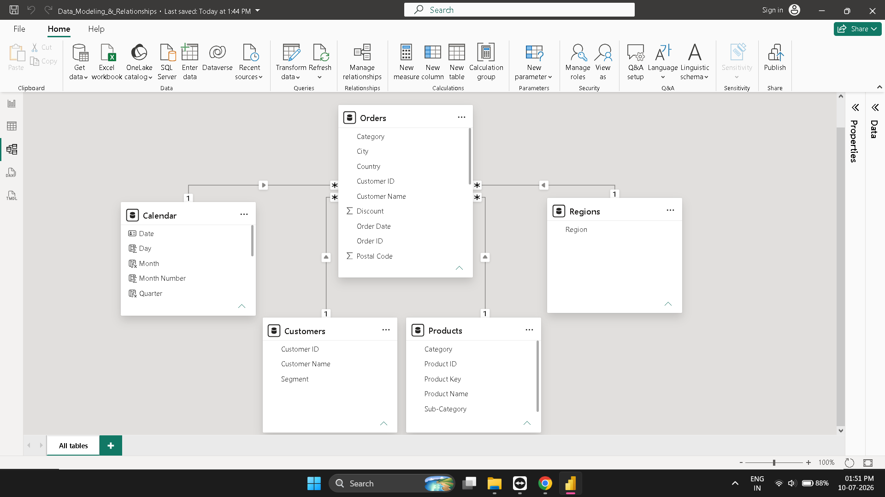

# 📊 Power BI Data Modeling & Relationships

## 📌 Project Overview

This project demonstrates the implementation of data modeling and relationship management in Power BI using the **Sample Superstore** dataset.

The primary objective was to build an optimized **Star Schema** by creating dimension tables, establishing one-to-many relationships, developing a Calendar table using DAX, and validating the data model for efficient reporting and analysis.

This project was completed as part of my **Power BI Internship – Week 2 Assignment**.

---

## 🎯 Objectives

- Create separate Dimension Tables
- Build One-to-Many Relationships
- Implement a Star Schema
- Create a Calendar Table using DAX
- Build a Date Hierarchy
- Validate Data Relationships
- Prepare the model for analytical reporting

---

## 📂 Dataset

The project uses the **Sample Superstore** dataset containing business sales information, including:

- Orders
- Customers
- Products
- Regions
- Sales
- Profit
- Quantity
- Discount
- Order Date
- Ship Date

Dataset Location:

```text
Dataset/
└── Sample-Superstore.csv
```

---

## 🛠️ Tools & Technologies

- Microsoft Power BI Desktop
- Power Query
- DAX (Data Analysis Expressions)
- Data Modeling

---

## 📊 Data Model

The following relationships were created:

| Dimension Table | Fact Table | Relationship |
|-----------------|------------|--------------|
| Customers | Orders | Customer ID |
| Products | Orders | Product Key |
| Regions | Orders | Region |
| Calendar | Orders | Order Date |

### Relationship Configuration

- **Cardinality:** One-to-Many (1:*)
- **Cross Filter Direction:** Single
- **Active Relationships:** Enabled

---

## 📅 Calendar Table

A dedicated Calendar table was created using DAX to support time intelligence.

### Calendar Fields

- Year
- Quarter
- Month
- Month Number
- Day

A Date Hierarchy was also created for easier time-based analysis.

---

## ⭐ Key Features

- ✔ Star Schema Design
- ✔ Fact & Dimension Tables
- ✔ Relationship Management
- ✔ Calendar Table Creation
- ✔ Date Hierarchy
- ✔ Data Validation
- ✔ Optimized Data Model

---

## 📁 Repository Structure

```
PowerBI-Data-Modeling-and-Relationships/
│
├── Data_Modeling_&_Relationships.pbix
├── README.md
│
├── Dataset/
│   └── Sample-Superstore.csv
└── Data_Model.png
```

---

## 📷 Project Preview

### Data Model



---

## 📚 Learning Outcomes

Through this project, I gained hands-on experience in:

- Designing Star Schema architecture
- Creating Fact and Dimension tables
- Building One-to-Many relationships
- Using Power Query for data preparation
- Creating Calendar Tables with DAX
- Building Date Hierarchies
- Validating relationships in Power BI
- Following best practices for data modeling

---

## 🚀 Getting Started

1. Clone this repository.
2. Open `Data_Modeling_&_Relationships.pbix` using Microsoft Power BI Desktop.
3. Refresh the data if required.
4. Explore the Data Model and relationships.

---

## 👨‍💻 Author

**Shagun Gupta**

Aspiring Data Analyst | Power BI | SQL | Python | Excel | Tableau
